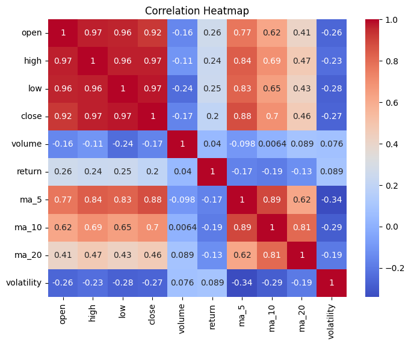
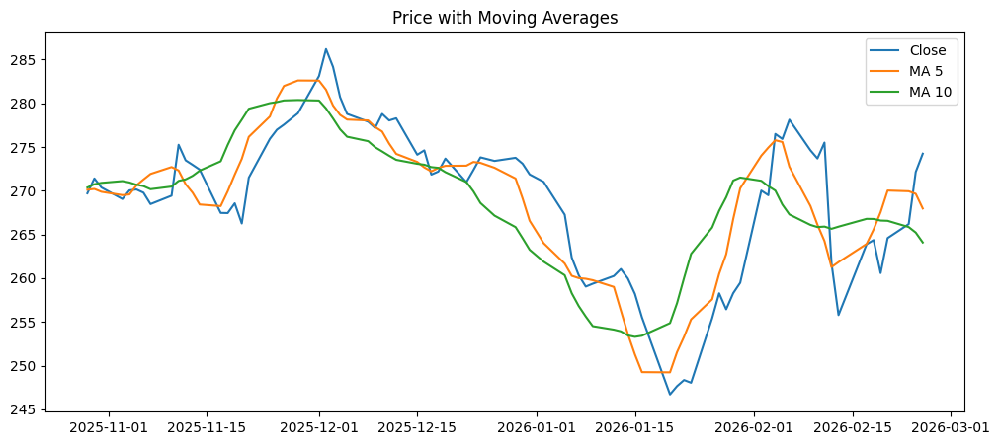

# 📊 Stock Analysis Pipeline

A Python-based data pipeline for fetching, processing, analyzing, and backtesting stock market data using the Alpha Vantage API.

---

## 🎯 Project Goal

The goal of this project is to simulate a real-world data pipeline:

- Data ingestion from external API (Alpha Vantage)
- Data cleaning and preprocessing
- Feature engineering (moving averages, returns, volatility)
- Data analysis and correlation study
- Visualization of stock trends and signals
- Simple backtesting of a trading strategy

---

## 🏗️ Project Structure

```
src/
  ├── ingestion/ # Fetch data from API
  ├── processing/ # Data cleaning
  ├── features/ # Feature engineering
  ├── analysis/ # Visualization & insights
  ├── strategies/ # Backtesting logic
  main.py
```

---

## 📊 Results

- Strong correlation between ma_5 and close (~0.87 based on dataset)
- Volume shows weak negative correlation with price
- Volatility increases during price drops

### Backtesting
- Strategy based on moving average signals
- Results stored in `data/processed/backtest.csv`

---

## 📈 Visualization

- Correlation heatmap between features
- Price chart with technical indicators
- Trading signals visualization


---

## 🚀 How to Run
```
1. Clone repository:
git clone https://github.com/AhmadJamei/stock-analysis-pipeline.git

2. Create virtual environment:
python -m venv venv

3. Activate:
venv\Scripts\activate  # Windows

4. Install dependencies:
pip install -r requirements.txt

5. Set API key:
Create `.env` file:
ALPHA_VANTAGE_API_KEY=your_api_key_here

6. Run:
python main.py
```

---

## 🛠️ Tech Stack

- Python
- Pandas
- NumPy
- Matplotlib
- Seaborn
- Alpha Vantage API

---

## 💡 Key Insights

```
- Short-term momentum strongly drives price (ma_5)
- Volume shows inverse relationship with price
- Volatility spikes during market downturns

## ⚡ What this project demonstrates

- Data pipeline design
- API integration
- Data cleaning & feature engineering
- Visualization & analysis
- Basic quantitative strategy development
```
---
## 📌 Notes

- Data is fetched using Alpha Vantage free API (rate limited)
- Raw and processed data are stored locally   
